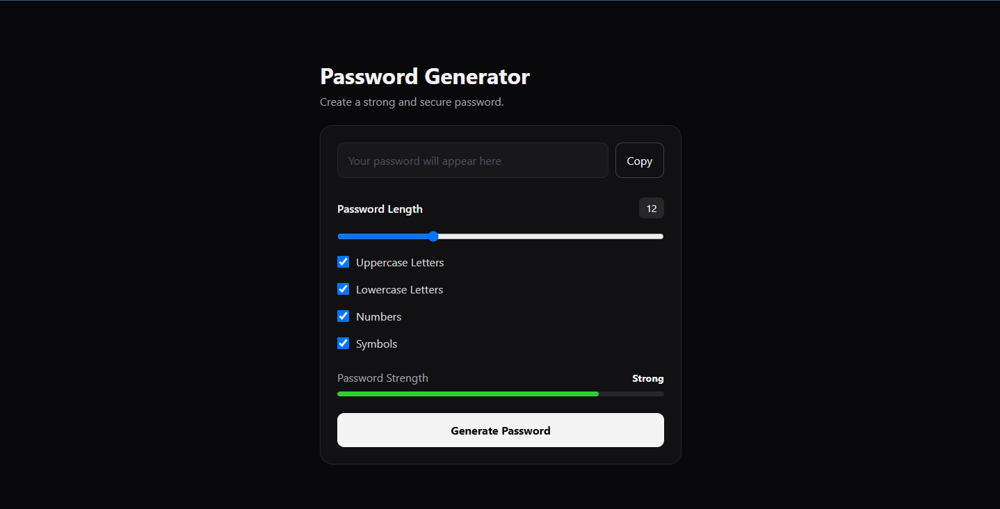

# 🔐 Password Generator

A modern and responsive **Password Generator** built with **HTML, CSS, and Vanilla JavaScript**.

The project allows users to generate random passwords based on their preferred length and character types, with a password strength indicator and one-click copy functionality.

## 🌐 Live Demo

[View Live Demo](https://a-h-m-e-d-z-a-h-e-r.github.io/Password-Generator/)

## ✨ Features

* 🔑 Generate random passwords
* 📏 Adjustable password length from 4 to 32 characters
* 🔠 Uppercase letters
* 🔡 Lowercase letters
* 🔢 Numbers
* 🔣 Symbols
* 💪 Password strength indicator
* 📋 One-click copy to clipboard
* ⚡ Automatically regenerate passwords when settings change
* 📱 Fully responsive design
* 🎨 Clean dark interface

## 🛠️ Tech Stack

* **HTML5**
* **CSS3**
* **JavaScript (Vanilla JS)**
* **Clipboard API**

## 🔐 Password Generation

The generator creates a character pool based on the selected options and randomly selects characters from that pool.

Users can control:

* Password length
* Uppercase characters
* Lowercase characters
* Numbers
* Symbols

The password strength indicator evaluates the generated password based on its length and selected character types.

## 🧩 Project Structure

```text
password-generator/
├── index.html
├── style.css
├── script.js
└── preview.png
````

### Architecture

* **`index.html`** — Application structure and password generator controls.
* **`style.css`** — Interface styling, responsive layout, and password strength states.
* **`script.js`** — Password generation, settings handling, strength calculation, dynamic updates, and clipboard functionality.

## 🎨 Interface

The application uses a clean dark interface focused on simplicity and usability.

The UI provides instant feedback when users change the password settings and allows generated passwords to be copied directly to the clipboard.

## 📱 Responsive Design

The interface is designed to work across different screen sizes, providing a consistent experience on:

* Desktop
* Tablet
* Mobile

## 🖼️ Screenshot



## 🎯 Project Goal

This project was built as a practical JavaScript project to strengthen **DOM manipulation, event handling, functions, conditional logic, random number generation, form controls, dynamic UI updates, and browser APIs**.

The goal was to build a small but complete utility application using vanilla JavaScript without external frameworks or libraries.

## 🧠 What I Practiced

* DOM manipulation
* Event listeners
* Arrays
* Functions
* Conditional logic
* Random number generation
* Dynamic UI updates
* Clipboard API
* Form controls
* Responsive CSS
* Building a complete project from scratch

## 👨‍💻 Author

**Ahmed Zaher Abdelmohsen**

Frontend Developer focused on building modern, responsive, and user-friendly web experiences.

* Portfolio: `https://a-h-m-e-d-z-a-h-e-r.github.io/Portfolio/`
* GitHub: `https://github.com/A-H-M-E-D-Z-A-H-E-R`

---

⭐ If you found this project interesting, feel free to explore the repository.

